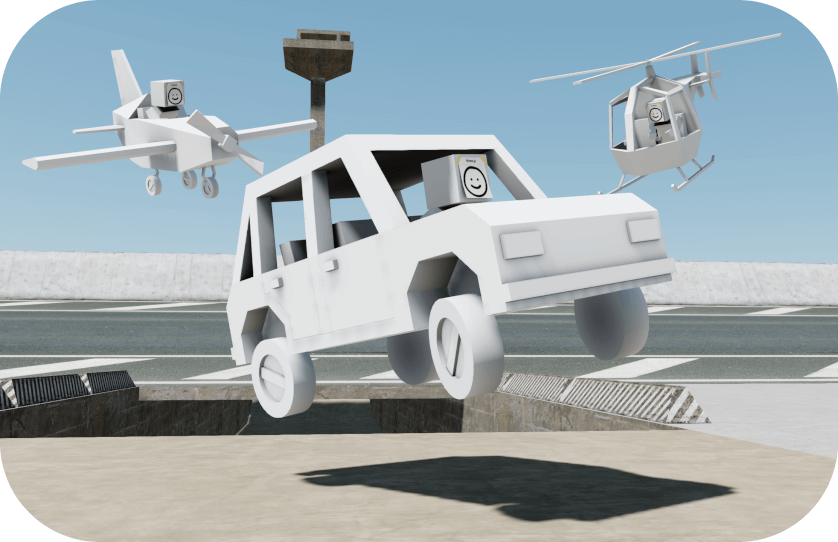

<p align="center">
	<a href="https://jblaha.art/sketchbook/latest"></a>
	<br>
	<a href="https://jblaha.art/sketchbook/latest">Live demo</a>
	<br>
</p>

[](https://www.npmjs.com/package/sketchbook)
[](https://travis-ci.org/swift502/Sketchbook)
[](https://discord.gg/fGuEqCe)

# Final update (20. Feb 2023)

Sketchbook is now archived. As I have no more interest in developing this project, it comes to a conclusion. In order to remain honest about the true state of the project, I am archiving this repository. I've put the project in the public domain, it now belongs to you. You can burn it on DVDs and sell it.

- If you wish to modify Sketchbook feel free to fork it.
- To see if someone is currently maintaining a fork, check out the [Network Graph](https://github.com/swift502/Sketchbook/network).
- The [NPM package](https://www.npmjs.com/package/sketchbook) name available, and I'll give it away to anyone who asks for it. The package has never worked properly.

# 📒 Sketchbook

Simple web based game engine built on [three.js](https://github.com/mrdoob/three.js) and [cannon.js](https://github.com/schteppe/cannon.js) focused on third-person character controls and related gameplay mechanics.

Mostly a playground for exploring how conventional third person gameplay mechanics found in modern games work and recreating them in a general way.

## Features

* World
	* Three.js scene
	* Cannon.js physics
	* Variable timescale
	* Frame skipping
	* FXAA anti-aliasing
* Characters
	* Third-person camera
	* Raycast character controller with capsule collisions
	* General state system
	* Character AI
* Vehicles
	* Cars
	* Airplanes
	* Helicopters

All planned features can be found in the [GitHub Projects](https://github.com/swift502/Sketchbook/projects).

## Usage

You can define your own scenes in Blender, and then read them with Sketchbook. Sketchbook needs to run on a local server such as [http-server](https://www.npmjs.com/package/http-server) or [webpack-dev-server](https://github.com/webpack/webpack-dev-server) to be able to load external assets.

<!-- #### Script tag -->

1. Import:

```html
<script src="sketchbook.min.js"></script>
```

2. Load a glb scene defined in Blender:

```javascript
const world = new Sketchbook.World('scene.glb');
```

<!--

#### NPM

1. Install:

```
npm i sketchbook
```

2. Import:

```javascript
import { World } from 'sketchbook';
```

3. Load a glb scene defined in Blender:

```javascript
const world = new World('scene.glb');
```

-->

## Contributing

1. Get the LTS version of [Node.js](https://nodejs.org/en/) 16
2. [Fork this repository](https://help.github.com/en/github/getting-started-with-github/fork-a-repo)
3. Run `npm install`
4. Run `npm run dev`
5. Make changes and test them out at http://localhost:8080
6. Commit and [make a pull request](https://help.github.com/en/github/collaborating-with-issues-and-pull-requests/creating-a-pull-request-from-a-fork)!

## Credits

Big thank you to each of the following github users for contributing to Sketchbook:

- [aleqsunder](https://github.com/aleqsunder)
- [barhatsor](https://github.com/barhatsor)
- [danshuri](https://github.com/danshuri)
